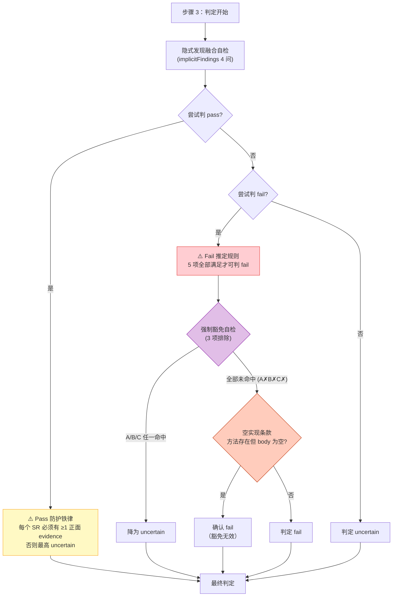
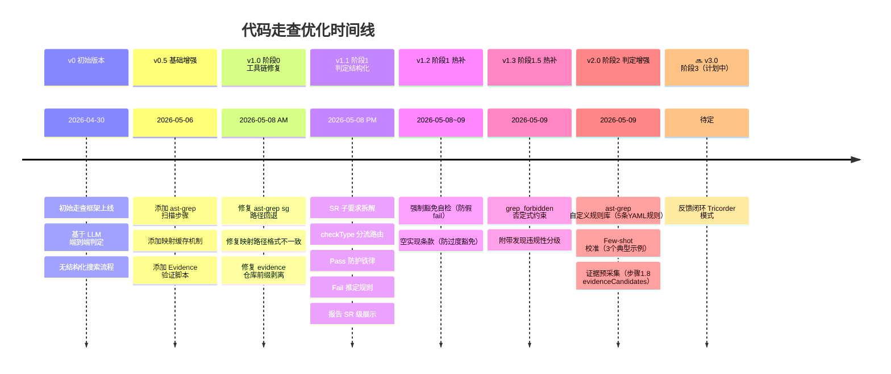
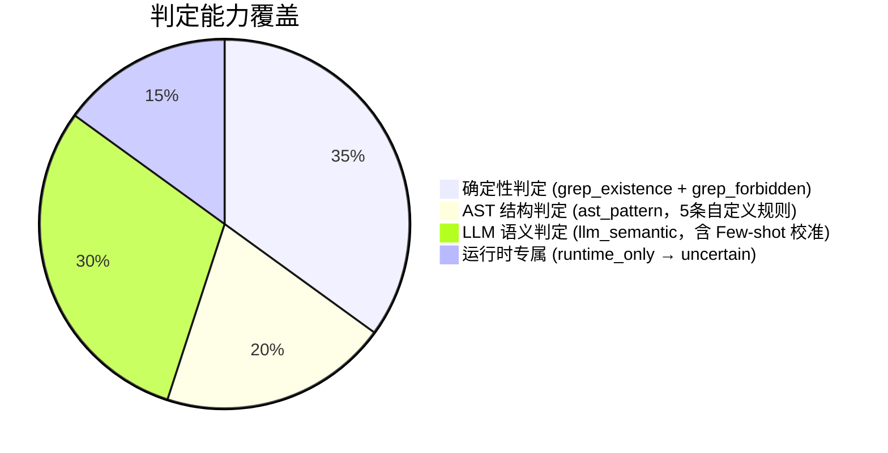
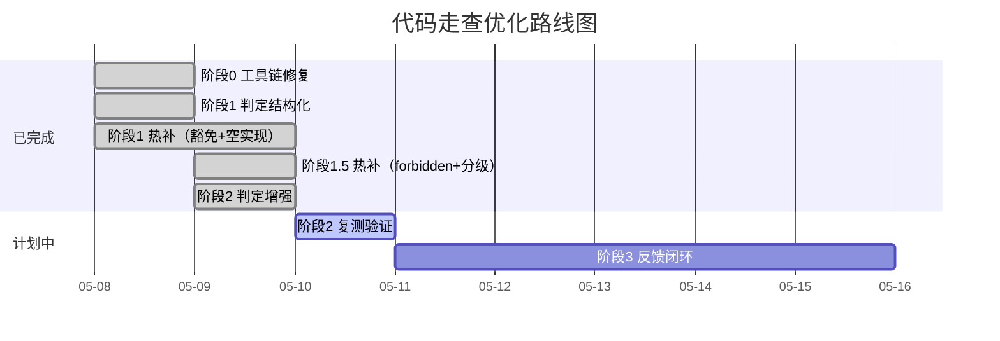

# AI 代码走查系统

> 隶属于 **AI 测试平台（ai-test-platform）** 的首个工作流模块。
> 文档维护人：梁 | 最后更新：2026-05-09

---

## 1. 系统定位

**一句话说明**：从需求文档自动提取「质量契约」，然后在代码仓库中搜索证据并判定每条契约的实现状态（pass / fail / uncertain），最终输出结构化报告。

**解决的核心问题**：
- 需求文档写完后，测试人员需要人工逐条核对代码是否实现——耗时且容易遗漏
- 不同人核对同一条需求可能得出不同结论——标准不统一
- 代码频繁变更后，回归核查成本高

**目标**：高频、稳定、低成本地自动化执行代码走查，输出可审计的结构化报告。

---

## 2. 整体流程

### 一句话概括

> 读需求 → 提契约 → 搜代码 → 给判定 → 出报告

### 三阶段总览

```
┌─────────────────────────────────────────────────────────────────────────┐
│                                                                         │
│   📄 需求文档          Phase 1              Phase 2              Phase 3│
│   (.docx/.md)    ──→  契约提取  ──→  代码走查（逐条）  ──→  报告生成   │
│                       ▼                    ▼                    ▼       │
│                  quality-contracts   contract-review     走查报告.md    │
│                  .json              -results.json                      │
│                                                                         │
│   💻 代码仓库 ──────────────────→  代码走查（逐条）                     │
│                                                                         │
└─────────────────────────────────────────────────────────────────────────┘
```

### Phase 1 契约提取 — "从需求文档里提炼出要检查什么"

```
需求文档
  │
  ▼
┌──────────────────────────────────────────────────────┐
│ 1. 读取文档内容                                       │
│ 2. 提取「质量契约」= 一条条可检查的业务规则            │
│    例："拖拽组件出引导区域后，组件返回原始位置"         │
│ 3. 将复杂规则拆成原子级「子要求 SR」                   │
│    例：SR-1 "拖出区域触发回退"                         │
│        SR-2 "组件回到原始位置"                         │
│ 4. 给每个 SR 标注验证类型 checkType                    │
│    例：SR-1 → grep_existence（搜代码看有没有）         │
│        SR-2 → llm_semantic（需要读懂代码逻辑）         │
└──────────────────────────────────────────────────────┘
  │
  ▼
📋 quality-contracts.json（契约库，后续走查的输入）
```

### Phase 2 代码走查 — "拿着契约去代码里找证据、给判定"

对每条契约，按顺序执行以下步骤：

```
步骤 1 搜索 ──→ 步骤 2 阅读 ──→ 步骤 3 判定 ──→ 步骤 4 记录
   │                │                │                │
   ▼                ▼                ▼                ▼
用关键词在代码    打开搜到的文件    根据读到的代码    把判定结果写入
库里全文搜索，    逐个阅读理解，    给出 pass/fail    JSON，运行验
找到相关文件      同时做隐式发现    /uncertain 判定   证脚本检查证据

搜索工具：                         判定有防护规则：
├─ Grep（文本搜索）                ├─ Pass 防护（必须有正面证据）
├─ ast-grep（代码结构扫描）        ├─ Fail 推定（搜遍了确实没有）
└─ Unity 资产搜索（Prefab等）      └─ 豁免自检（防止误判）
```

### Phase 3 报告生成 — "把走查结果整理成人能看的报告"

```
contract-review-results.json（机器数据）
  │
  ▼
┌───────────────────────────────────────┐
│ 汇总统计（多少条 pass/fail/uncertain）│
│ 逐条展示判定详情 + 证据 + 缺口       │
│ 附带发现（走查中顺带发现的问题）      │
└───────────────────────────────────────┘
  │
  ▼
📊 2026-05-08-1733-新手引导.md（人看的报告）
```

---

## 3. 关键概念

### 3.1 质量契约 (Quality Contract)

| 字段 | 说明 |
|------|------|
| `moduleLabel` | 模块名，用于分类（如「新手引导 > 关卡选择」） |
| `rule` | 简体中文陈述句，可审计的业务规则 |
| `boundaryHint` | 边界/精度/并发等风险与特例 |
| `priority` | P0 / P1 / P2 |
| `verifyMethods` | `code_review` / `api_test` / `ui_test` |
| `layer` | `data` / `business` / `ux` |
| `subRequirements` | （可选）原子级子要求数组 |

### 3.2 子要求 (Sub-Requirement, SR)

将一条契约拆解为可独立验证的原子断言。每个 SR 有独立的 `checkType`、`keywords`、`passCondition`、`failCondition`。

### 3.3 checkType 路由（共 5 种）

每个子要求 SR 根据其性质，被分配一种 checkType，决定"用什么方式去验证它"：

```
                        子要求 SR
                           │
                     checkType 是什么？
                           │
         ┌────────┬────────┼────────┬────────┐
         ▼        ▼        ▼        ▼        ▼

   grep_existence  grep_forbidden  ast_pattern  llm_semantic  runtime_only
   "功能存不存在"   "禁止的东西      "代码结构     "需要读懂     "只能运行
                    有没有出现"       匹配"        代码语义"     时才能看出"

   搜关键词        搜关键词          ast-grep     AI 阅读       跳过搜索
   搜到→可能pass   搜到→fail        结构匹配     代码后判定     直接标
   没搜到→fail     没搜到→pass      (阶段2扩展)                uncertain
                                    暂降级为grep
```

| # | checkType | 适用场景 | 判定方式 | 举例 |
|---|-----------|---------|---------|------|
| 1 | `grep_existence` | 某功能/方法是否存在 | 程序自动：Grep 搜关键词 | "拖拽安装功能" → 搜 `DragPart` |
| 2 | `grep_forbidden` | 需求明确禁止的东西 | 程序自动：搜到 = 违规 | "不做弹簧平滑" → 搜 `SmoothDamp` |
| 3 | `ast_pattern` | 代码结构模式匹配 | 程序自动：ast-grep（阶段 2 扩展，暂降级为 grep） | "事件 += 有没有对应的 -=" |
| 4 | `llm_semantic` | 需要理解代码含义才能判定 | AI 判定（受防护规则约束） | "拖拽失败后回退逻辑是否正确" |
| 5 | `runtime_only` | 纯运行时行为，代码看不出来 | 跳过，直接标 uncertain | "动画播放是否流畅" |

### 3.4 判定防护规则体系



**三层防护逻辑**：

| 层级 | 规则名 | 通俗解释 | 防止什么 |
|------|--------|---------|---------|
| 1 | Pass 防护铁律 | 想判「通过」？先证明每个子要求都有实打实的代码证据 | 防止「搜到文件名就判通过」的虚高 |
| 2 | Fail 推定规则 | 关键词搜遍了全库确实 0 结果 → 功能确实没做 → 判不通过 | 让真正缺失的功能被准确标为 fail |
| 2.1 | 强制豁免自检 | 判 fail 前先想想：是不是换了个名字实现了？（见下方详解） | 防止「搜不到关键词就判不通过」的误杀 |
| 2.2 | 空实现条款 | 找到了方法但里面是空的 → 没做就是没做，不能豁免 | 防止空壳方法被当作「已实现」 |
| 3 | 否决铁律 | 代码里发现了和需求矛盾的证据 → 绝不能判通过 | 防止有矛盾证据还硬判 pass |

**2.1 强制豁免自检的 3 种检查方式详解**：

> **背景问题**：搜索关键词搜不到 ≠ 功能没做。有时候开发实现了功能，但没用你猜的那个方法名。如果仅因为搜不到就判 fail，会产生误判。所以判 fail 前必须排除以下 3 种情况：

| # | 检查场景 | 怎么检查 | 真实案例 |
|---|---------|---------|---------|
| A | **通用机制实现** | 功能是否通过已有的通用系统间接完成了？→ AI 回头检查已读代码中 OnDrop、Update 等通用方法里有没有相关逻辑 | 需求写「拖拽失败后组件回退」，代码里没有 `ReturnToBag()` 方法，但 `OnDrop` 的通用逻辑里有 `transform.position = HitHolder.position` 实现了相同效果 → 不能判 fail |
| B | **回调/事件模式** | 功能是否通过回调参数、事件派发实现，而非独立方法？→ AI 检查构造函数参数、Action 委托、事件注册 | 需求写「点击任意位置关闭」，代码里没有 `anyClick()` 方法，但通过 `AssistantPanelData(outSideAction=FinishAction)` 回调实现了 → 不能判 fail |
| C | **配置驱动** | 功能是否通过 Unity Prefab、Animator、配置表实现，而非写在 .cs 代码里？→ AI 搜索 .prefab 文件中的属性 | 需求写「按钮高亮提示」，.cs 代码里没有设置高亮色，但 Prefab 的 Button 组件已配置了 `m_HighlightedColor` → 不能判 fail |

```
搜索关键词全库 0 命中 → 准备判 fail
  │
  ├─ A 通用机制检查：回看已读代码的通用方法 → 找到了？→ 豁免为 uncertain
  ├─ B 回调模式检查：检查构造函数/委托参数 → 找到了？→ 豁免为 uncertain
  ├─ C 配置驱动检查：搜索 .prefab 属性     → 找到了？→ 豁免为 uncertain
  │
  └─ 三项全部没找到 → 确认判 fail
       │
       └─ 但如果找到了对应方法，方法体是空的 → 空实现条款 → 仍然判 fail
```

### 3.5 附带发现 (Side Findings)

走查过程中，AI 在阅读代码时可能会发现与当前契约无直接关系、但值得关注的代码问题。这些"顺带发现"按严重程度分为 4 级：

| 违规性 | 含义 | 后续动作 |
|--------|------|---------|
| **违规** | 与需求文档中的某条明确约束矛盾 | 见下方「违规升级机制」 |
| **潜在违规** | 看起来不太对但没有直接矛盾的需求条款 | 需与策划/开发确认 |
| **建议改进** | 代码质量/健壮性问题，不违反任何需求 | 值得修复但不阻塞 |
| **待确认** | 需运行时验证才能判定 | 下次测试时关注 |

**违规升级机制**（标为「违规」时的处理流程）：

```
走查契约 #7 时，顺带发现一个代码问题
  │
  ├─ 这个问题与需求文档中的某条约束直接矛盾？
  │   │
  │   ├─ 是 → 标为「违规」
  │   │   │
  │   │   ├─ 已有契约覆盖？→ 补充为该契约的新 SR → 该 SR 判 fail → 该契约判 fail
  │   │   └─ 无契约覆盖？ → 创建新的独立契约 → 下轮走查时单独检查
  │   │
  │   └─ 否 → 标为「潜在违规」/「建议改进」/「待确认」→ 记录，不影响当前判定
```

**举例**：走查"拖拽安装"契约时，发现代码里有个无限循环（退化循环 bug）。
- 如果需求文档里写了"组件升级不得无限循环" → 违规 → 升级为 SR → fail
- 如果需求文档没有相关约束 → 建议改进 → 记录到报告中，提醒开发注意

---

## 4. 工具链与数据流

### 工具与数据的关系

```
                    ┌──────────────────────────────────────────────────────┐
                    │                   走查执行过程                       │
                    │                                                      │
 契约库             │   ①搜索阶段          ②判定阶段         ③验证阶段   │
 (contracts.json)──→│                                                      │
                    │   Grep 文本搜索 ──→  AI 阅读+判定 ──→ 验证脚本     │
 映射缓存           │        │                  │               │         │
 (mapping.json) ──→│   ast-grep 扫描       防护规则约束     自动检查证据  │
                    │        │                  │               │         │
                    │        ▼                  ▼               ▼         │
                    │   AST扫描结果        走查结果JSON ←── 标记验证结果   │
                    │   (ast-grep.json)    (results.json)                  │
                    │        │                  │                          │
                    │        │                  ├──→ 映射缓存更新脚本      │
                    │        │                  │       │                  │
                    │        │                  │       ▼                  │
                    │        └──────────────────│──→ 映射缓存              │
                    │                           │    (mapping.json)        │
                    │                           │                          │
                    └───────────────────────────│──────────────────────────┘
                                                │
                                                ▼
                                          走查报告.md
                                          （给人看的）
```

### 工具说明

> Grep 是 Cursor IDE 内置的搜索能力（底层用 ripgrep），AI 可以直接调用。其余 4 个是我们单独开发的 Python 脚本，**用来弥补 AI 做不好或不该做的事情**。

| 工具 | 来源 | 做什么 | 为什么需要它 |
|------|------|--------|------------|
| **Grep** | Cursor 内置 | 在代码库里按关键词全文搜索 | 这是走查的基础——先搜到相关代码，AI 才能去读和判定 |
| **ast-grep 扫描脚本** | 自主开发 | 分析代码结构：哪些类有哪些方法、谁调用了谁、继承关系 | Grep 只能搜文本，不懂代码结构。比如搜 `Start` 会搜到几百个结果，ast-grep 能精确告诉你"TutorialManager 类的 Start 方法在第 42 行" |
| **证据验证脚本** | 自主开发 | 检查 AI 给出的证据是否真实：文件存不存在、行号对不对、方法名是否在那一行 | AI 有时会"编造"文件路径或行号（幻觉）。这个脚本用程序化方式校验，不依赖 AI 自己说"我确认过了" |
| **映射缓存更新脚本** | 自主开发 | 记住"新手引导模块对应哪些代码文件"，下次走查同模块时直接用 | 每次走查都从头搜索很慢。走查一次后把结果缓存起来，下次同模块走查搜索速度大幅提升 |
| **仓库配置脚本** | 自主开发 | 统一管理各个代码仓库的路径，确保文件路径格式一致 | 有 4 个代码仓库在不同位置，路径格式不统一会导致搜索和验证出错 |

### 数据文件说明

| 文件 | 一句话解释 | 谁写入 | 谁读取 | 保留策略 |
|------|-----------|--------|--------|---------|
| **quality-contracts.json** | 从需求文档里提取出来的「要检查的规则」清单 | Phase 1 契约提取 | Phase 2 走查时逐条取用 | 永久保留，可追加新契约 |
| **contract-review-results.json** | 每次走查的详细机器数据（判定、证据、置信度等完整字段） | Phase 2 走查过程 | Phase 3 报告生成、映射缓存脚本 | 永久保留，按日期追加 |
| **quality-reports/*.md** | 给人看的走查报告，从 results.json 中提取关键信息排版 | Phase 3 报告生成 | 人工阅读、周会汇报 | 按日期时间命名，永久保留 |
| **module-file-mapping.json** | "新手引导 → 这些 .cs 文件" 的对应关系缓存 | 映射缓存脚本 | 下次走查时加速搜索 | 走查后自动更新，越用越准 |
| **ast-grep-latest.json** | 最近一次 AST 扫描的原始结果（方法列表、调用关系） | ast-grep 脚本 | 映射缓存脚本（提取依赖图） | 每次走查覆盖 |

**contract-review-results.json 和 quality-reports/*.md 的区别**：

```
results.json（机器数据）                  reports/*.md（人看的报告）
┌──────────────────────┐                ┌──────────────────────────┐
│ 完整 JSON 结构        │    提取排版     │ 总览统计表                │
│ 每条证据的文件/行号   │ ──────────→    │ 逐条判定 + 关键证据摘要   │
│ 置信度数值            │                │ 附带发现表格              │
│ 语义关联数据          │                │ 可以直接给人看            │
│ 内部才用的字段        │                └──────────────────────────┘
└──────────────────────┘
```

**module-file-mapping.json 和 ast-grep-latest.json 的区别**：

```
ast-grep-latest.json（一次性原始数据）    mapping.json（持续积累的缓存）
┌──────────────────────┐                ┌──────────────────────────┐
│ 本次扫描发现的：       │    汇总积累     │ 历史走查积累的：           │
│ - 方法定义列表         │ ──────────→    │ - 模块 → 核心文件映射      │
│ - 调用关系             │                │ - 文件间依赖图             │
│ - 继承关系             │                │ - 语义关联                 │
│ 每次走查覆盖重写       │                │ - 功能簇分组               │
│ = 快照                 │                │ 持续增长 = 知识库          │
└──────────────────────┘                └──────────────────────────┘
```

---

## 5. 仓库配置

当前已接入的代码仓库：

| repoId | 名称 | 路径 | 版本管理 |
|--------|------|------|---------|
| `client` | Client（客户端） | `C:\Demo\client` | Plastic SCM |
| `ds` | DS（战斗服） | `C:\Demo\ds` | Plastic SCM |
| `config` | Config（配置表） | `C:\Demo\config` | Plastic SCM |
| `gameplay` | Gameplay（局外服务端） | `C:\Demo\gameplay` | Git |

> 仓库路径通过 `repo_config.py` 统一管理，evidence 中的文件路径统一为仓库相对路径。

---

## 6. 优化迭代记录

### 迭代总览时间线



### 详细变更记录

#### 阶段 0 — 工具链修复（2026-05-08 上午）

> **目标**：修复基础工具链中的 bug，确保搜索和验证流程正常运转。

| # | 问题 | 修复 | 影响 |
|---|------|------|------|
| 0-A | `ast_grep_scan.py` 在 `sg` 不可用时静默返回 exit 0 | 加入 `shutil.which` + `SG_PATH` 环境变量检测，失败时 exit 1 | ast-grep 不再被静默跳过 |
| 0-B | `module-file-mapping.json` 混入绝对路径，跨机器失效 | 引入 `repo_config.py` 统一路径归一化 | 映射缓存跨机器可用 |
| 0-C | `verify_evidence.py` 因 evidence 路径含 `repoId/` 前缀导致 `file_not_found` | 添加 `_strip_repo_prefix()` 自动剥离 | evidence 验证通过率修复 |

#### 阶段 1 — 判定逻辑结构化（2026-05-08 下午）

> **目标**：解决 LLM 判定不稳定问题。核心思路是将「一条契约整体判」拆解为「多个原子子要求逐个判」，并加入确定性防护规则约束 LLM 的判定行为。

| # | 改动项 | 内容 | 解决的问题 |
|---|--------|------|-----------|
| 1-A | 契约结构扩展 | 新增 `subRequirements` 数组，每个 SR 含 `checkType`/`keywords`/`passCondition`/`failCondition` | 复合规则一判了之，遗漏子项 |
| 1-B | checkType 分流 | 4 类路由：grep_existence / ast_pattern / llm_semantic / runtime_only | 所有判定都走 LLM 语义，确定性判定被浪费 |
| 1-C | Pass/Fail 防护规则 | Pass 铁律（每个 SR 须有正面 evidence）+ Fail 推定（充分搜索后确认缺失） | 无正面证据也判 pass（虚高）+ 明确缺失也判 uncertain（偏软） |
| 1-D | 报告格式升级 | 增加 SR 级判定表，展示每个子要求的独立结论 | 报告只有最终判定，看不到是哪个子项出了问题 |

**效果**：阶段 1 上线后，对同一需求的走查报告中，虚假 pass 被大幅消除，真正缺失的功能被准确标为 fail。

#### 阶段 1 热补 — 防护规则精修（2026-05-08 ~ 05-09）

> **目标**：修正 Fail 推定规则的过严/过宽问题。

| # | 改动项 | 内容 | 触发原因 |
|---|--------|------|---------|
| 热补1 | 强制豁免自检 | 判 fail 前必须排除 3 种假阴性：通用机制实现 / 回调模式 / Prefab 配置驱动 | 拖拽失败回退、弱引导退出等通过通用机制实现的功能被误判 fail |
| 热补2 | 空实现条款 | 方法存在但 body 为空 → 豁免无效 → 仍判 fail | `OnExitTutorialArea()` 空方法被豁免为 uncertain，实际应为 fail |

**热补1 + 热补2 形成互制关系**：热补1 防止假 fail（向宽松方向矫正），热补2 防止热补1 过度豁免（向严格方向回拉），两者配合达到平衡。

#### 阶段 1.5 热补 — 开发反馈驱动（2026-05-09）

> **目标**：根据开发团队的 agent 评估反馈，修补两项判定盲区。

| # | 改动项 | 内容 | 反馈来源 |
|---|--------|------|---------|
| 热补3 | `grep_forbidden` | 新增第 5 种 checkType，用于"不做 X"类否定式约束，搜到即 fail | 开发评估指出：「镜头」需求明确禁止弹簧/阻尼平滑，走查未有效检测 |
| 热补4 | 附带发现违规性分级 | sideFindings 改为表格输出，新增 4 级违规性标注 | 开发评估指出：退化循环等严重 bug 被埋在「待确认」中，无分级无法区分轻重 |

#### 阶段 2 — 判定增强（2026-05-09）

> **目标**：提升确定性判定覆盖率，校准 LLM 判定一致性，减少 evidence 幻觉。

| # | 改动项 | 内容 | 预期收益 |
|---|--------|------|---------|
| 2-A | ast-grep 自定义规则库 | 创建 5 条 YAML 规则（空方法体、事件配对、协程无yield、GetComponent），脚本新增 `scan_custom_rules()` + `analyze_event_pairing()`，`ast_pattern` checkType 不再降级 | 空方法体等模式由 AST 确定性检测，不再依赖 LLM 推断 |
| 2-B | Few-shot 校准 | 在判定步骤前新增 3 个典型示例（pass: 完整调用链、fail: 空实现条款、uncertain: 豁免触发），LLM 判定时对照校准 | 提升不同模型间的判定一致性 |
| 2-C | 证据预采集 | 新增步骤 1.8，将所有搜索产出结构化为 `evidenceCandidates` 列表，步骤 3 引用 evidence 必须从此列表或步骤 2 Read 中选取 | 杜绝 LLM 遗忘早期搜索结果或编造不存在的文件/行号 |

**新增文件**：

| 文件 | 说明 |
|------|------|
| `scripts/ast-rules/empty-method-body.yaml` | 检测空方法体（直接支撑空实现条款） |
| `scripts/ast-rules/event-subscribe-unpaired.yaml` | 检测事件 += 订阅点 |
| `scripts/ast-rules/event-unsubscribe.yaml` | 检测事件 -= 取消点 |
| `scripts/ast-rules/coroutine-no-yield.yaml` | 检测 IEnumerator 方法无 yield |
| `scripts/ast-rules/getcomponent-no-null-check.yaml` | 检测 GetComponent 调用点 |

---

## 7. 走查报告解读指南

### 报告结构

每份走查报告包含以下部分：

```
📊 走查报告
├── 总览表（契约数量、通过/违规/存疑统计、工具状态）
├── 走查详情（逐条契约）
│   ├── 规则 + 边界提示
│   ├── 子要求判定表（SR 级明细）
│   ├── 汇总判定
│   ├── 证据列表
│   ├── 缺口说明
│   └── 附带发现（含违规性分级）
└── 未走查契约（非 code_review 类型）
```

### 判定结果含义

| 判定 | 含义 | 行动 |
|------|------|------|
| ✅ **pass** | 代码中找到充分证据支撑规则成立 | 无需行动 |
| ❌ **fail** | 代码中确认功能缺失或与规则矛盾 | 需开发修复 |
| ❓ **uncertain** | 证据不足以判定 | 需人工确认或运行时验证 |

### 置信度参考

| 范围 | 含义 |
|------|------|
| 75-95% | 关键路径找到，逻辑完全吻合或明确矛盾 |
| 40-65% | 找到部分代码，关键路径不完整 |
| 5-35% | 无法定位相关目录或文件，材料严重不足 |

---

## 8. 已产出的走查报告

| 报告文件 | 日期 | 模块 | 阶段 | 备注 |
|----------|------|------|------|------|
| `2026-04-30-新手引导.md` | 04-30 | 新手引导 | v0 初始版本 | 首次走查 |
| `2026-05-06-新手引导.md` | 05-06 | 新手引导 | v0.5 | 基础增强后 |
| `2026-05-06-新手引导-·对A对比.md` | 05-06 | 新手引导 | v0.5 | 对比测试 |
| `2026-05-06-2107-新手引导.md` | 05-06 | 新手引导 | v0.5 | 晚间复测 |
| `2026-05-07-1456-新手引导.md` | 05-07 | 新手引导 | v0.5 | Sonnet 4.6 模型 |
| `2026-05-07-1520-新手引导.md` | 05-07 | 新手引导 | v0.5 | Opus 4.7 模型（质量对比基准） |
| `2026-05-08-1118-新手引导.md` | 05-08 | 新手引导 | 阶段0 修复后 | 工具链修复验证 |
| `2026-05-08-1453-新手引导.md` | 05-08 | 新手引导 | 阶段1 上线 | SR 结构化首次验证 |
| `2026-05-08-1733-新手引导.md` | 05-08 | 新手引导 | 阶段1 + 热补1 | 豁免自检验证 |
| `2026-05-08-2001-alienstar-exp-slice-1.md` | 05-08 | AlienStar 体验切片 | 阶段1 + 热补1 | 跨项目泛化验证 |

---

## 9. 当前状态与后续路线图

### 当前状态：v2.0（阶段 2 完成）

已实现的能力：



- ✅ 契约提取 + SR 子要求拆解
- ✅ 5 种 checkType 路由（含 `grep_forbidden`）
- ✅ 3 层判定防护规则（Pass 铁律 + Fail 推定 + 豁免自检 + 空实现条款）
- ✅ Evidence 程序化验证
- ✅ v2 映射缓存（coreFiles + 依赖图 + 语义关联 + 功能簇）
- ✅ 附带发现违规性分级
- ✅ ast-grep 自定义规则库（5 条 YAML 规则，`ast_pattern` 不再降级）
- ✅ Few-shot 校准（3 个典型 pass/fail/uncertain 示例）
- ✅ 证据预采集（步骤 1.8 evidenceCandidates 汇总，杜绝 evidence 幻觉）
- ⬜ 开发反馈闭环尚未建立

### 后续路线图



#### 阶段 2：ast-grep 规则增强 + Few-shot 校准 + 证据预采集（✅ 已完成）

| 子项 | 内容 | 预期收益 |
|------|------|---------|
| ast-grep 自定义规则库 | 为高频模式编写 YAML 规则（事件配对、空方法体、单例引用等），`ast_pattern` 不再降级 | 确定性判定覆盖率提升 |
| Few-shot 校准 | 在判定步骤加入 2-3 个典型 pass/fail/uncertain 样例 | LLM 判定一致性提升 |
| 证据预采集 | 搜索阶段即结构化 `{file, line, snippet}`，判定时直接引用 | 减少 LLM 幻觉 |

#### 阶段 3：反馈闭环 Tricorder 模式

| 子项 | 内容 | 预期收益 |
|------|------|---------|
| 开发反馈收集 | 报告交付后收集「准确/误判/遗漏」标注 | 建立真实准确率基线 |
| 反馈回注 | 误判案例生成 Few-shot 样本或错题本 | 持续自动纠偏 |
| 规则命中率追踪 | 统计每条防护规则的触发率和准确率 | 定向优化低效规则 |

---

## 10. 使用方式

### 基本用法

```
走查 @d:\Downloads\需求文档.docx
```

### 高级用法

| 指令 | 效果 |
|------|------|
| `走查 @文档.docx` | 使用已有契约 + 缓存（最快） |
| `走查 @文档.docx 重新搜索代码` | 保留契约，全量重新搜索 |
| `走查 @文档.docx 重新提取契约 重新搜索代码` | 完全从头来过 |

### 跨项目走查

系统支持多仓库，在 `SKILL.md` 的仓库配置表中添加新仓库即可。当前已验证：
- Demo 项目（client / ds / config / gameplay）
- AlienStar 项目（alienstar）

---

## 附录：目录结构

```
f:\SuperAI\ai-test-platform\
├── docs\
│   └── ai-code-review.md          ← 本文档
├── data\
│   ├── quality-contracts.json      ← 契约库
│   ├── contract-review-results.json ← 走查结果
│   ├── module-file-mapping.json    ← 映射缓存
│   ├── ast-grep-latest.json        ← AST 扫描结果
│   └── quality-reports\            ← 走查报告
│       ├── 2026-04-30-新手引导.md
│       ├── 2026-05-08-1733-新手引导.md
│       └── ...
└── ...

f:\SuperAI\.cursor\skills\quality-contract-review\
├── SKILL.md                        ← 走查流程完整定义
└── scripts\
    ├── ast_grep_scan.py            ← AST 扫描
    ├── verify_evidence.py          ← Evidence 验证
    ├── update_mapping.py           ← 映射缓存更新
    └── repo_config.py              ← 仓库配置
```
